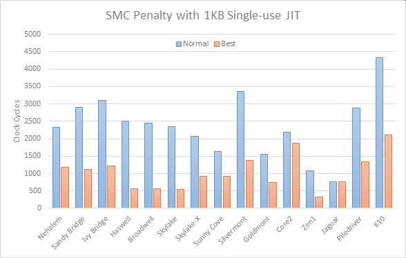

Single-use JIT Performance on x86 Processors
======

Suppose you have the following code:

```
mem_page = allocate_memory_page(permissions = read+write+execute)
begin loop
	write_1kb_function_code_to(mem_page)
	mem_page() ; execute written code
end loop
```

This is essentially a JIT where the code is only used once, before being overwritten and used again.
<small>(Note, this code will not work on an OS which enforces [W^X](https://en.wikipedia.org/wiki/W%5EX) security. Currently, the most widely used OSes on x86 do not enforce W^X, hence the above technique is viable on most machines. For this investigation, I will assume no W^X is being enforced)</small>

x86 processors fully support [self-modifying code](https://en.wikipedia.org/wiki/Self-modifying_code) (SMC), without needing the program to signal anything to the processor (e.g. no flush instruction necessary), which means that x86 processors need to automatically detect writes to instruction data and handle them immediately.

The above code, although not really a true SMC scenario, is often detected as such, due to the JIT code residing in instruction cache when it needs to be written to. Such writes usually involve invalidating caches and flushing pipelines, which causes severe performance penalties.

I came across this issue whilst investigating an algorithm like the above for [performing GF(2<sup>16</sup>) multiplication](https://github.com/animetosho/ParPar/blob/master/xor_depends/info.md), and noticed that there are techniques that can be done to mitigate this performance penalty.

However, I’ve been unable to find much information on this, and even less in terms of actual test results. Hence, this repository hosts some test code, and results from experimentation, which intends to investigate ways in which to reduce the overhead of such code.

## Test Summary

I’ve tried to think up a number of scenarios which might have an impact on the above behaviour, and implemented these into this test application.

It’s best to [look at the code](https://github.com/animetosho/jit_smc_test/blob/62b4beb2120e1c3403e7c0f904c0c160434f4160/test.c#L181-L758) to see the tests that are run, but a summary of ideas tried is listed here:

- obvious approach - that is, just write the code an execute it, as shown at the top of this page (labelled [`jit_plain`](https://github.com/animetosho/jit_smc_test/blob/62b4beb2120e1c3403e7c0f904c0c160434f4160/test.c#L181-L185) in results). Also tests writing the code in reverse to see if that has any effect (labelled [`jit_reverse`](https://github.com/animetosho/jit_smc_test/blob/62b4beb2120e1c3403e7c0f904c0c160434f4160/test.c#L203-L207)).
- for reference: JIT-to and execute separate locations. This doesn’t achieve the aim above, since it isn’t actually executing the JIT’d code, but is used to demonstrate the ideal case of having no penalty (labelled [`jit_only`](https://github.com/animetosho/jit_smc_test/blob/62b4beb2120e1c3403e7c0f904c0c160434f4160/test.c#L193-L201)), as well as compute the SMC penalty on processors
- write code to non-executable memory (temporary location), then copy it to the allocated executable memory, using a range of techniques including `memcpy` (labelled [`jit_memcpy*`](https://github.com/animetosho/jit_smc_test/blob/62b4beb2120e1c3403e7c0f904c0c160434f4160/test.c#L209-L326)). If the memory copy means that fewer write operations hit the executable memory, it may mean fewer syncs/flushes are needed
- ‘clear’ executable memory before writing code, i.e. overwrite the region with null bytes, using `memset`, or take a shortcut by writing once to each 64-byte cacheline (labelled [`jit_clr*`](https://github.com/animetosho/jit_smc_test/blob/62b4beb2120e1c3403e7c0f904c0c160434f4160/test.c#L329-L484)). Maybe this helps invalidate the cache quickly before the JIT process would’ve done it slowly?
- flushing cachelines before/after writing code (labelled [`jit_clflush*`](https://github.com/animetosho/jit_smc_test/blob/62b4beb2120e1c3403e7c0f904c0c160434f4160/test.c#L486-L541)). Maybe this helps push the data out of the separate L1 instruction/data cache ahead of time?
- prefetching code to L2 cache, with/without write hinting (labelled [`jit_prefetch*`](https://github.com/animetosho/jit_smc_test/blob/62b4beb2120e1c3403e7c0f904c0c160434f4160/test.c#L543-L569)). L1 caches separate data and instructions, but L2 is shared, so any changes to instruction data must go through L2 before arriving at the instruction cache. Prefetching is usually used to *promote* data to a lower level of cache, not demote to a higher level, but maybe some processors can take note of the write hint and act accordingly
- leaving a `UD2` instruction at the beginning of the executable code, until the JIT process is complete (labelled [`jit_ud2`](https://github.com/animetosho/jit_smc_test/blob/62b4beb2120e1c3403e7c0f904c0c160434f4160/test.c#L571-L579)). Maybe this helps with preventing the processor from prefetching the code as it’s being written to
- alternate between a number of pre-allocated pages (labelled [`jit_*region`](https://github.com/animetosho/jit_smc_test/blob/62b4beb2120e1c3403e7c0f904c0c160434f4160/test.c#L611-L653)). This might help by reducing the likelihood that the JIT writing touches memory that is cached for execution, however, this is fairly expensive in terms of cache usage
- trying to clear the instruction cache by [jumping across a large number of cachelines](jump.s) (labelled [`jit_jmp*`](https://github.com/animetosho/jit_smc_test/blob/62b4beb2120e1c3403e7c0f904c0c160434f4160/test.c#L694-L720)). Probably thrashes the instruction cache however
- seeing whether applying a memory fence (`MFENCE` instruction) or serializing operation (`CPUID` instruction) between writing and executing the code, makes any difference (labelled [`jit_mfence`](https://github.com/animetosho/jit_smc_test/blob/62b4beb2120e1c3403e7c0f904c0c160434f4160/test.c#L723-L728) and [`jit_serialize`](https://github.com/animetosho/jit_smc_test/blob/62b4beb2120e1c3403e7c0f904c0c160434f4160/test.c#L738-L745))
- writing to and executing from [different virtual addresses which map to the same physical page](https://github.com/animetosho/jit_smc_test/blob/62b4beb2120e1c3403e7c0f904c0c160434f4160/test.c#L70-L93) (labelled [`jit_dual_mapping`](https://github.com/animetosho/jit_smc_test/blob/62b4beb2120e1c3403e7c0f904c0c160434f4160/test.c#L747-L758)). The Intel manual suggests that such behaviour requires a serializing instruction before executing the written code, which [presumably means that code can be written without invoking self-modifying code behaviour](https://www.realworldtech.com/forum/?threadid=192834&curpostid=192883)

Note that the [JIT routine itself](https://github.com/animetosho/jit_smc_test/blob/62b4beb2120e1c3403e7c0f904c0c160434f4160/test.c#L149-L161) writes out instructions one-by-one, and doesn’t attempt to batch multiple instructions into a single write.

Testing performance is done using the [`RDTSC` instruction](https://en.wikipedia.org/wiki/Time_Stamp_Counter). To reduce variability, it is measured across multiple iterations, and [multiple trials are performed](https://github.com/animetosho/jit_smc_test/blob/62b4beb2120e1c3403e7c0f904c0c160434f4160/test.c#L129-L144) to find the fastest measure.

## Observations

The results, listed below, vary significantly across processor micro-architectures. Tests were performed on a variety of systems, including some on virtual machines. All code was compiled with GCC for x86-64.

### Intel Core

* Alternating between a number of regions, enough to exceed L1 cache size, appears to be the most effective technique ([`jit_16region`](https://github.com/animetosho/jit_smc_test/blob/62b4beb2120e1c3403e7c0f904c0c160434f4160/test.c#L633-L639)), however this could affect the performance of other code.
* Clearing the target before writing code, is second most effective (slightly worse than above), particularly if you just clear one byte per cacheline ([`jit_clr_1byte`](https://github.com/animetosho/jit_smc_test/blob/62b4beb2120e1c3403e7c0f904c0c160434f4160/test.c#L373-L381))
* `CLFLUSHOPT` is effective on Skylake/X ([`jit_clflushopt`](https://github.com/animetosho/jit_smc_test/blob/62b4beb2120e1c3403e7c0f904c0c160434f4160/test.c#L525-L533)). Pre-Skylake, copying is also effective ([`jit_memcpy*`](https://github.com/animetosho/jit_smc_test/blob/62b4beb2120e1c3403e7c0f904c0c160434f4160/test.c#L209-L326))
* Clearing the instruction cache with jumps touching all the cachelines, seems to also be effective on Haswell and later ([`jit_jmp32k_unalign`](https://github.com/animetosho/jit_smc_test/blob/62b4beb2120e1c3403e7c0f904c0c160434f4160/test.c#L701-L707)). This may affect performance of other code as it effectively flushes out the instruction cache

Raw results: [Nehalem](results/Nehalem.txt), [Sandy Bridge](<results/Sandy Bridge.txt>), [Ivy Bridge](<results/Ivy Bridge (win64).txt>), [Haswell](results/Haswell.txt), [Broadwell](<results/Broadwell (xen).txt>), [Skylake](results/Skylake.txt), [Skylake-X](<results/Skylake-X (win64).txt>)

### Intel Atom

* Silvermont ([raw result](results/Silvermont.txt))
  * Copying appears to be the most effective, particularly if non-temporal writes are used in the copy ([`jit_memcpy_sse2_nt`](https://github.com/animetosho/jit_smc_test/blob/62b4beb2120e1c3403e7c0f904c0c160434f4160/test.c#L262-L268))
  * Clearing the region seems effective too. Only one byte per cacheline is sufficient ([`jit_clr_1byte`](https://github.com/animetosho/jit_smc_test/blob/62b4beb2120e1c3403e7c0f904c0c160434f4160/test.c#L373-L381))
  * Issuing `CLFLUSH` ([`jit_clflush`](https://github.com/animetosho/jit_smc_test/blob/62b4beb2120e1c3403e7c0f904c0c160434f4160/test.c#L507-L515)) or `PREFETCHW` ([`jit_prefetchw`](https://github.com/animetosho/jit_smc_test/blob/62b4beb2120e1c3403e7c0f904c0c160434f4160/test.c#L543-L552)) over the region also seems to work
    <small>(I thought Silvermont didn’t support `PREFETCHW` instruction added in Broadwell, but as it turns out, it supports the `PREFETCHW` instruction from 3DNow!)</small>
* Goldmont ([raw result](<results/Goldmont (win64).txt>))
  * Copying ([`jit_memcpy*`](https://github.com/animetosho/jit_smc_test/blob/62b4beb2120e1c3403e7c0f904c0c160434f4160/test.c#L209-L326)) and clearing ([`jit_clr*`](https://github.com/animetosho/jit_smc_test/blob/62b4beb2120e1c3403e7c0f904c0c160434f4160/test.c#L329-L484)) are both effective
  * The most effective techniques appear to be copying with non-temporal writes ([`jit_memcpy_sse2_nt`](https://github.com/animetosho/jit_smc_test/blob/62b4beb2120e1c3403e7c0f904c0c160434f4160/test.c#L262-L268)), clearing the memory using non-temporal writes ([`jit_clr_sse2_nt`](https://github.com/animetosho/jit_smc_test/blob/62b4beb2120e1c3403e7c0f904c0c160434f4160/test.c#L412-L418)), or issuing `CLFLUSHOPT` over the executable region before writing ([`jit_clflushopt`](https://github.com/animetosho/jit_smc_test/blob/62b4beb2120e1c3403e7c0f904c0c160434f4160/test.c#L525-L533))

### Intel Core2

* Copying with non-temporal writes ([`jit_memcpy_sse2_nt`](https://github.com/animetosho/jit_smc_test/blob/62b4beb2120e1c3403e7c0f904c0c160434f4160/test.c#L262-L268)) seems to have a slight advantage over the straightforward method

([raw result](results/Core2.txt))

### AMD Family 17h

* Zen1 ([raw result](<results/Zen1 (VM).txt>))
  * Copying seems to be the only effective method ([`jit_memcpy*`](https://github.com/animetosho/jit_smc_test/blob/62b4beb2120e1c3403e7c0f904c0c160434f4160/test.c#L209-L326)). Unlike other CPUs here, non-temporal writes perform worse
  * Unlike on Intel Core CPUs, where overwriting the instruction code seems to invalidate the data from the instruction cache, it seems like Zen1 maintains some sync between the two. This means that repeatedly overwriting the same code, that exists in instruction cache, can have a slowdown effect, even if the code is never executed later

### AMD Family 16h

* Jaguar ([raw result](<results/Jaguar (win64).txt>))
  * None of the techniques tested seem to improve upon the plain case

### AMD Family 15h

* Piledriver ([raw result](results/Piledriver.txt))
  * Copying ([`jit_memcpy*`](https://github.com/animetosho/jit_smc_test/blob/62b4beb2120e1c3403e7c0f904c0c160434f4160/test.c#L209-L326)) and clearing ([`jit_clr*`](https://github.com/animetosho/jit_smc_test/blob/62b4beb2120e1c3403e7c0f904c0c160434f4160/test.c#L329-L484)) are both effective, as well as issuing `PREFETCHW` instructions ([`jit_prefetchw`](https://github.com/animetosho/jit_smc_test/blob/62b4beb2120e1c3403e7c0f904c0c160434f4160/test.c#L543-L552))
  * The most effective appears to be copying with non-temporal writes ([`jit_memcpy_sse2_nt`](https://github.com/animetosho/jit_smc_test/blob/62b4beb2120e1c3403e7c0f904c0c160434f4160/test.c#L262-L268))

### AMD K10

* Copying is effective ([`jit_memcpy*`](https://github.com/animetosho/jit_smc_test/blob/62b4beb2120e1c3403e7c0f904c0c160434f4160/test.c#L209-L326)), particularly with non-temporal writes ([`jit_memcpy_sse2_nt`](https://github.com/animetosho/jit_smc_test/blob/62b4beb2120e1c3403e7c0f904c0c160434f4160/test.c#L262-L268))

([raw result](results/K10.txt))

### All Processors

* Although, according to Intel documentation, x86 processors don’t need to sync code/instruction data if they are at different virtual addresses, I found that processors did this anyway, if these point to the same physical address. I found that, even [removing the synchronization instruction, code would still work](https://www.realworldtech.com/forum/?threadid=192834&curpostid=192913)
* Not shown in the results here, but I did test with writing 4KB of code instead of 1KB of code, and found that the measured time also roughly quadrupled. This suggests that the SMC penalty is proportional to the amount of code written, so the idea of writing multiple functions before executing any, doesn’t seem to help much (unless it’s enough to exceed the L1 instruction cache and the processor is an Intel Core processor)

To make this page a little interesting than just text, here’s a chart to show you something visual, comparing the SMC penalty with the obvious solution and the best solution indicated above:



Note that there’s significant variation between the processors/systems tested, so measurements *between* processors probably shouldn’t be compared, but it can nonetheless show how much of an improvement can be made with techniques found above.

## Summary

The performance of the example shown at the top of this document can be improved, often by a fair margin, by applying some techniques listed above. Unfortunately, there is no single ‘best solution’, as it varies depending on the underlying micro-architecture.

From the results I have (and speculation on my part for results I don’t have) the best solution is:

* If CPU is Intel Core (Nehalem or later):
  * Alternate between areas of memory (enough to be larger than L1 cache size), i.e. JIT to location 1, execute location 1, JIT to location 2, execute location 2 etc, and loop around ([`jit_16region`](https://github.com/animetosho/jit_smc_test/blob/62b4beb2120e1c3403e7c0f904c0c160434f4160/test.c#L633-L639))
  * If the above is not possible, or the cache hit is unacceptable, clear 1 byte per 64-byte cacheline in the area to be written to, before actually writing instructions ([`jit_clr_1byte`](https://github.com/animetosho/jit_smc_test/blob/62b4beb2120e1c3403e7c0f904c0c160434f4160/test.c#L373-L381))
* Else if CPU is Intel Atom, Intel Core2, AMD Family 15h or AMD K10:
  * Write code to a temporary location, then copy to the destination using [non-temporal writes](https://stackoverflow.com/a/37092) ([`jit_memcpy_sse2_nt`](https://github.com/animetosho/jit_smc_test/blob/62b4beb2120e1c3403e7c0f904c0c160434f4160/test.c#L262-L268)). SSE1/2 writes are sufficient, as none of these CPUs have 256-bit load/store ports
* Else if CPU is AMD Family 17h, 18h or newer AMD:
  * Write code to a temporary location, then copy to the destination (`REP MOVS` seems to be optimal ([`jit_memcpy_movsb`](https://github.com/animetosho/jit_smc_test/blob/62b4beb2120e1c3403e7c0f904c0c160434f4160/test.c#L218-L233)), but `memcpy` probably works fine too ([`jit_memcpy`](https://github.com/animetosho/jit_smc_test/blob/62b4beb2120e1c3403e7c0f904c0c160434f4160/test.c#L209-L215)))
* Otherwise (AMD Family 16h and unknowns):
  * Just write directly to the destination ([`jit_plain`](https://github.com/animetosho/jit_smc_test/blob/62b4beb2120e1c3403e7c0f904c0c160434f4160/test.c#L181-L185))

Probably not emphasised enough, but I do stress that the results here are specific to the test case examined here. If you implement a single-use JIT algorithm, results may vary depending on how much code is written and the way it is written (e.g. fewer write *operations* will perform better than more numerous smaller writes).

## Further Experimentation

Tests on processors not listed here are welcome, as are any other findings, corrections and suggestions.

### Compiling/Running the Test Application

The code currently does not implement dynamic runtime dispatch, so should be compiled using GCC/Clang with the `-march=native` flag on the machine running the code.
The following command can be used to compile this test:

```
cc -g -std=gnu99 -O3 -march=native -o test test.c jump.s
```

Note that you may need to also add `-lrt` to the end, on some Linux distros.

I’ve noticed significant variability in results when running the test. The code does try to cater for this, by running multiple trials and taking the fastest run, but it may be beneficial to set the CPU governor/power profile to Performance, and disabling turbo boost, before running the test. Note that I haven’t done this for any of the results though.

